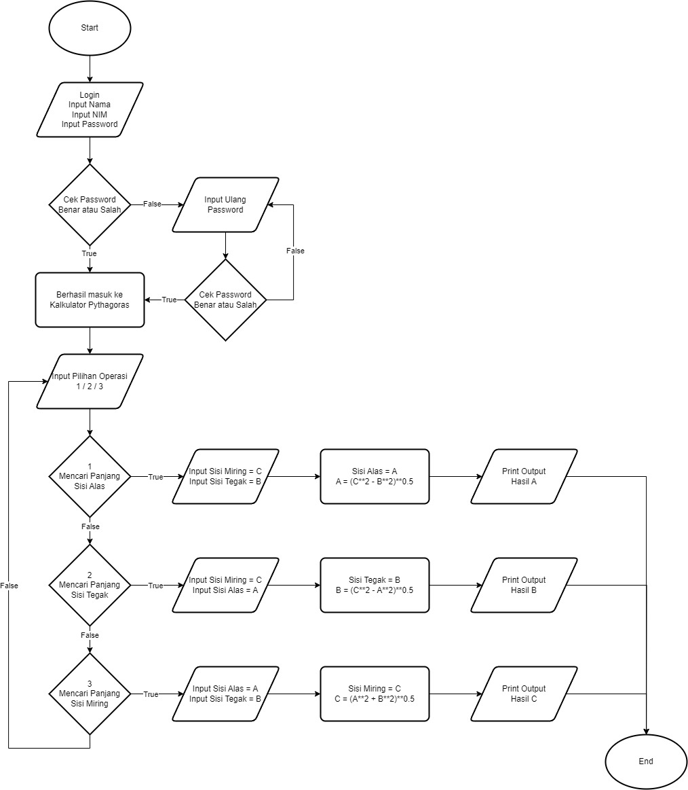
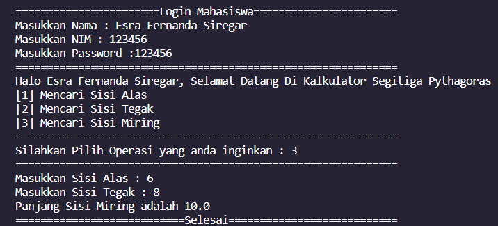
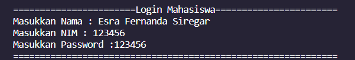
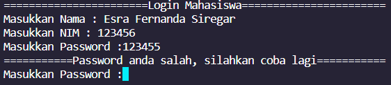
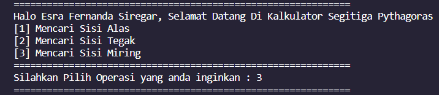
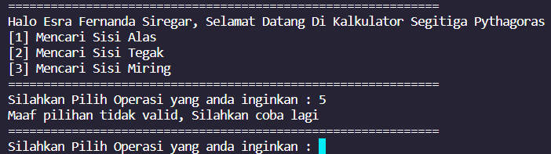
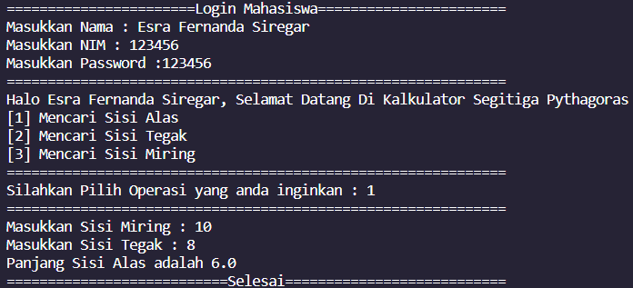
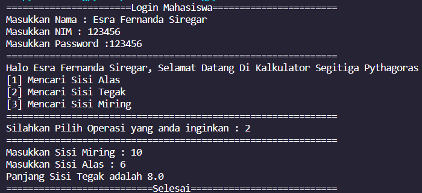

# Post Test Praktikum DDP 1

Esra Fernanda Siregar | 2309116049 | Sistem informasi A

Ini adalah Post Test 1, yaitu membuat Kalkulator Segitiga Pythagoras
### Flowchart Kalkulator Segitiga Pythagoras

### Contoh Output Awal hingga Akhir

### Dokumentasi

1. User melakukan login dengan memasukkan Nama, NIM, dan Password (Password sama dengan NIM)

Apabila Password salah, User akan diminta untuk memasukkan ulang Password

2. Setelah Login berhasil, User akan diminta untuk memilih operasi yang diinginkan.

Apabila User memasukkan nilai yang tidak sesuai dengan yang tersedia, User akan diminta untuk memasukkan kembali pilihan

3. User akan diminta untuk memasukkan data yang diperlukan untuk menyelesaikan operasi. Setelah selesai, hasil akan diberikan kepada User

### Note
- Password sama dengan NIM yang dimasukkan
- Apabila Password salah, akan diarahkan kembali untuk memasukkan password
- Saat pemilihan operasi, apabila memasukkan selain (1, 2, 3) akan diarahkan kembali ke pemilihan operasi

## Screenshoot Setiap Opsi

1. Mencari Sisi Alas

2. Mencari Sisi Tegak

3. Mencari Sisi Miring

